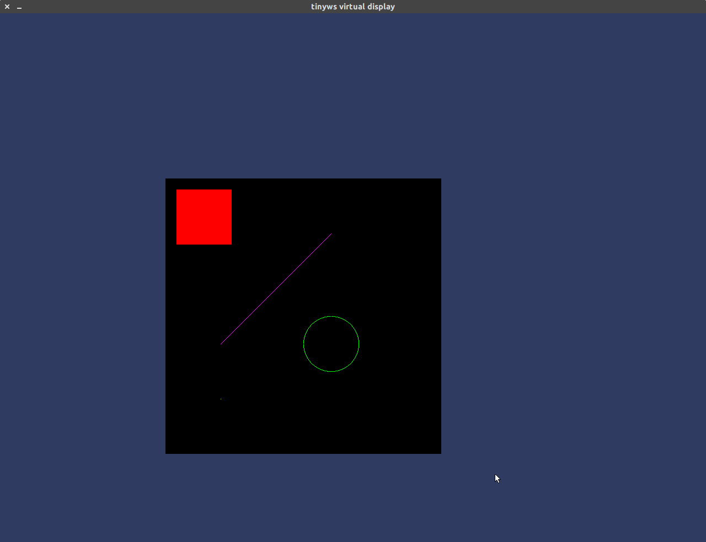
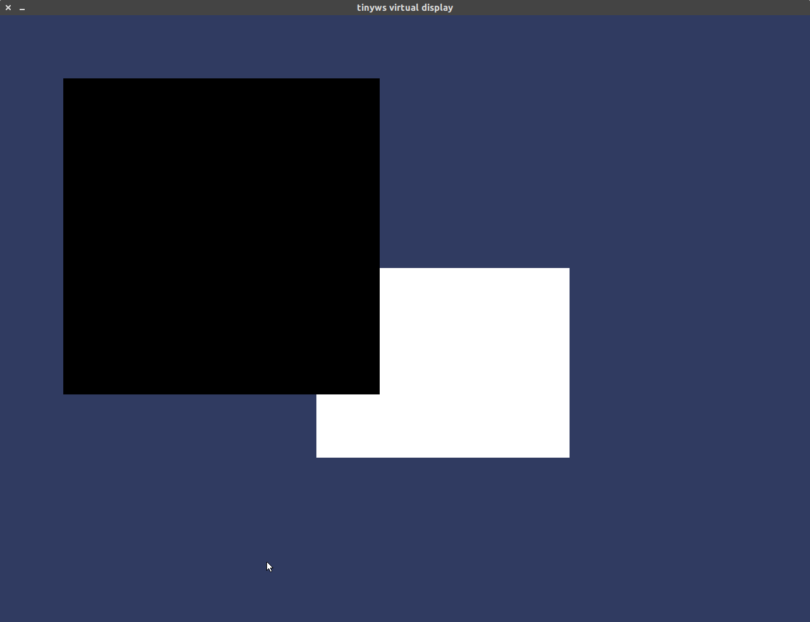
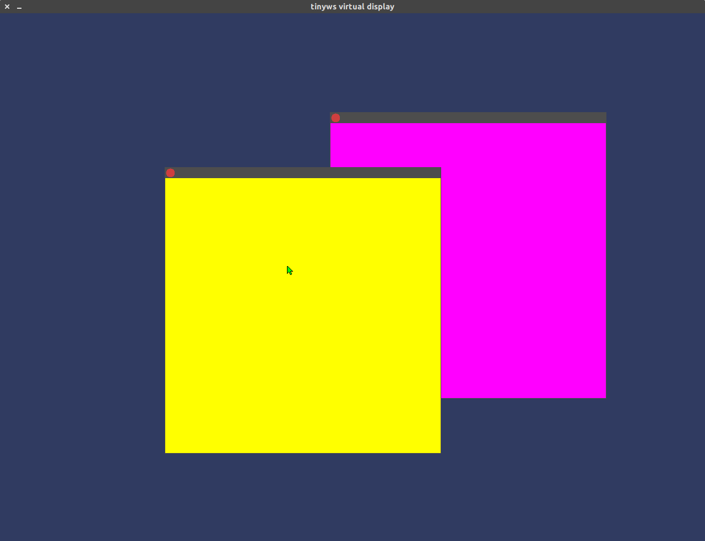

# tinyws

サーバー・クライアント方式の簡易ウィンドウシステム

|プログラム|機能|
|-------------------------|-------------------------|
|`server.out`|クライアントからの要求に応じて、ウィンドウの作成、ウィンドウの各種プロパティの変更、ウィンドウに対する描画などを行う。SDLによるウィンドウを仮想的なディスプレイとみなして、描画を行う。|
|`client_example.out`|対話式でサーバーにリクエストを送ることが出来る。`> help`または`> ?`と入力するとコマンドの一覧を表示する。|
|`client_window_manager.out`|ウィンドウにフレームを追加して、D&Dで移動したりウィンドウを閉じたりすることが出来る。|

## 依存ライブラリ

- [SDL2](https://wiki.libsdl.org/Installation)

## ビルド

```
$ make
```

## 起動

サーバー
```
$ ./server.out [portno]
```

クライアント
```
$ ./client_example.out [portno]
```

ウィンドウマネージャ
```
$ ./client_window_manager.out [portno]
```

## スクリーンショット

長方形、円、直線、点の描画


複数ウィンドウ


ウィンドウマネージャによるウィンドウフレーム



## プロトコル

サーバーとクライアントの接続を確立したあと、
クライアントがサーバーにリクエストを送ると、
サーバーはそれに対するレスポンスを返す。
この動作を繰り返す。

リクエスト・レスポンスはそれぞれ以下のフォーマットに従ってシリアライズされる。

<details>
<summary>クリックで詳細を開く</summary>

### リクエストのフォーマット

扱う整数は全てリトルエンディアンで格納する。

次の順にバイト列を構成する。

1. 先頭4バイトにリクエストの種類を表すenum値を格納する。
2. 操作対称のウィンドウのIDを4バイトで格納する。
3. リクエストのパラメータを格納する。これはリクエストの種類によって異なるが、以下の表の「パラメータ」の列に示した整数を順に格納する。

#### 各リクエストの詳細

|リクエストの名前(enum値)|パラメータ|対応するレスポンス|説明|
|---------------------------------|---------------------------------|---------------------------------|---------------------------------|
|TINYWS_REQUEST_DRAW_RECT(0)|x座標(4バイト), y座標(4バイト), 幅(4バイト), 高さ(4バイト), 塗りつぶすかどうか(1バイト), 色RGBA(合計4バイト)|TINYWS_RESPONSE_NOCONTENT|長方形を描画する。塗りつぶすかどうかは0か1で表す。|
|TINYWS_REQUEST_DRAW_CIRCLE(1)|中心x座標(4バイト), 中心y座標(4バイト), 半径(4バイト), 塗りつぶすか(1バイト), 色RGBA(合計4バイト)|TINYWS_RESPONSE_NOCONTENT|円を描画する。塗りつぶすかどうかは0か1で表す。|
|TINYWS_REQUEST_DRAW_LINE(2)|P1のx座標(4バイト), P1のy座標(4バイト), P2のx座標(4バイト), P2のy座標(4バイト), 色RGBA(合計4バイト)|TINYWS_RESPONSE_NOCONTENT|点P1と点P2を結ぶ線分を描画する。|
|TINYWS_REQUEST_DRAW_PIXEL(3)|x座標(4バイト), y座標(4バイト), 色RGBA(合計4バイト)|TINYWS_RESPONSE_NOCONTENT|点を描画する。|
|TINYWS_REQUEST_CLEAR_WINDOW(4)|(なし)|TINYWS_RESPONSE_NOCONTENT|指定したウィンドウの内容を消す。(ウィンドウの背景色で塗りつぶす)|
|TINYWS_REQUEST_REFRESH(5)|(なし)|TINYWS_RESPONSE_NOCONTENT|画面を再描画する。|
|TINYWS_REQUEST_CREATE_WINDOW(6)|位置X座標(4バイト), 位置Y座標(4バイト), 幅(4バイト), 高さ(4バイト), 背景色RGBA(合計4バイト)|TINYWS_RESPONSE_WINDOW_INFO|新しいウィンドウを作成する。|
|TINYWS_REQUEST_CLOSE_WINDOW(7)|(なし)|TINYWS_RESPONSE_NOCONTENT|既存のウィンドウを閉じる。|
|TINYWS_REQUEST_SET_WINDOW_POS(8)|位置X座標(4バイト), 位置Y座標(4バイト)|TINYWS_RESPONSE_NOCONTENT|ウィンドウの位置を設定する。|
|TINYWS_REQUEST_SET_WINDOW_VISIBILITY(9)|可視状態(1バイト)|TINYWS_RESPONSE_NOCONTENT|ウィンドウの可視状態を変更する。1なら可視状態、0なら不可視状態を表す。|
|TINYWS_REQUEST_SET_FOCUS(10)|(なし)|TINYWS_RESPONSE_NOCONTENT|ウィンドウのフォーカスを変更する。|
|TINYWS_REQUEST_GET_WINDOW_INFO(11)|(なし)|TINYWS_RESPONSE_WINDOW_INFO|指定したウィンドウに関する情報を要求する。|
|TINYWS_REQUEST_MOVE_WINDOW_TOP(12)|(なし)|TINYWS_RESPONSE_NOCONTENT|指定したウィンドウを最前面に移動する。|
|TINYWS_REQUEST_WINDOW_REPARENT(13)|新しい親ウィンドウのID(4バイト)|TINYWS_RESPONSE_NOCONTENT|ウィンドウの親を変更する。(ウィンドウマネージャ用の機能)|
|TINYWS_REQUEST_GET_TOPLEVEL_WINDOW(14)|ルートウィンドウとして扱うウィンドウのID(4バイト)|TINYWS_RESPONSE_WINDOW_INFO|指定したウィンドウを子孫に持つようなトップレベルのウィンドウを返す。|
|TINYWS_REQUEST_APPLY_FOR_WM}(15)|(なし)|TINYWS_RESPONSE_NOCONTENT|このクライアントをウィンドウマネージャとして登録する。|
|TINYWS_REQUEST_GET_EVENT(16)|(なし)|TINYWS_RESPONSE_EVENT_NOTIFY|指定したウィンドウのイベントキューの内容を1つ取り出す。|

なお、「対応するレスポンス」について、リクエストが失敗した場合は、「TINYWS_RESPONSE_NOCONTENT」を用いて失敗したことを通知する。

### レスポンスのフォーマット

扱う整数は全てリトルエンディアンで格納する。

次の順にバイト列を構成する。

2. リクエストが成功した(1)か失敗したか(0)を1バイトで格納す。
1. レスポンスの種類を表すenum値を4バイトで格納する。
3. レスポンスの内容を格納する。これはレスポンスの種類によって異なるが、以下の表の「内容」の列に示した整数を順に格納する。

#### 各レスポンスの詳細

|レスポンスの名前(enum値)|内容|説明|
|-------------------------|-------------------------|-------------------------|
|TINYWS_RESPONSE_NOCONTENT(0)|(なし)|内容の無いレスポンス。|
|TINYWS_RESPONSE_WINDOW_INFO(1)|ウィンドウID(4バイト), 位置X座標(4バイト), 位置Y座標(4バイト), 幅(4バイト), 高さ(4バイト)|ウィンドウの情報を返す際に用いる。|
|TINYWS_RESPONSE_EVENT_NOTIFY(2)|イベントをシリアライズしたもの(詳しくは下の表に記す)|発生したイベントを通知する際に用いる。|

### イベントのシリアライズ

扱う整数は全てリトルエンディアンで格納する。
次の順にバイト列を構成する。

1. イベントの種類を表すenum値を4バイトで格納する。
2. イベントが発生したウィンドウのIDを4バイトで格納する。
3. イベントの内容を格納する。次のイベントの詳細の「内容」の列に示した整数を順に格納する。

### イベントの詳細

|イベントの名前(enum値)|内容|説明|
|-------------------------|-------------------------|-------------------------|
|TINYWS_EVENT_MOUSE_DOWN|マウスのボタンを表すenum値(4バイト), カーソルの座標(x, y各4バイト), カーソルのディスプレイ上での絶対座標(x, y各4バイト), マウスカーソルのある位置でもっとも前面に表示されているウィンドウのID(4バイト)|マウスのボタンが押されたときに発生する。|
|TINYWS_EVENT_MOUSE_UP|(TINYWS_EVENT_MOUSE_DOWNと同じ)|マウスのボタンが放されたときに発生する。|
|TINYWS_EVENT_MOUSE_MOVE|(TINYWS_EVENT_MOUSE_DOWNと同じ。ただし、「マウスのボタン」は不定値。)|マウスを動かしたときに発生する。|
|TINYWS_EVENT_KEY_DOWN|キーコードを表すenum値(4バイト)|キーボードのキーを押したときに発生する。|
|TINYWS_EVENT_KEY_UP|(TINYWS_EVENT_KEY_DOWNと同じ)|キーボードのキーを放したときに発生する。|
|TINYWS_EVENT_CLOSE_CHILD_WINDOW|子ウィンドウのID(4バイト)|子ウィンドウが閉じられたときに発生する。|
|TINYWS_WM_EVENT_NOTIFY_CREATE_WINDOW|新しく追加されたウィンドウのID(4バイト), 位置X座標(4バイト), 位置Y座標(4バイト), 幅(4バイト), 高さ(4バイト)|ウィンドウマネージャが監視しているウィンドウに新しいウィンドウが追加された際に通知される。|

#### マウスのボタンを表すenum値(対応しているもの)

|ボタン|enum値|
|-------------------------|-------------------------|
|左クリック|TINYWS_MOUSE_LEFT_BUTTON(0)|
|右クリック|TINYWS_MOUSE_LEFT_BUTTON(1)|

#### キーコードを表すenum値(対応しているもの)

|キー|enum値|
|-------------------------|-------------------------|
|矢印キー上|TINYWS_KEYCODE_ARROW_UP(0)|
|矢印キー下|TINYWS_KEYCODE_ARROW_DOWN(1)|
|矢印キー左|TINYWS_KEYCODE_ARROW_LEFT}(2)|
|矢印キー右|TINYWS_KEYCODE_ARROW_RIGHT}(3)|
|スペースキー|TINYWS_KEYCODE_SPACE(4)|
|エンターキー|TINYWS_KEYCODE_ENTER}(5)|

</details>

